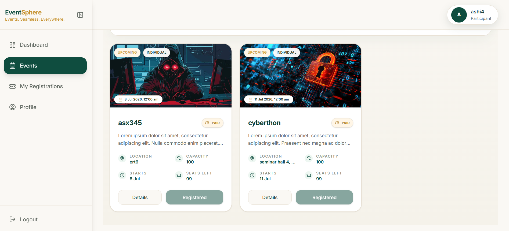
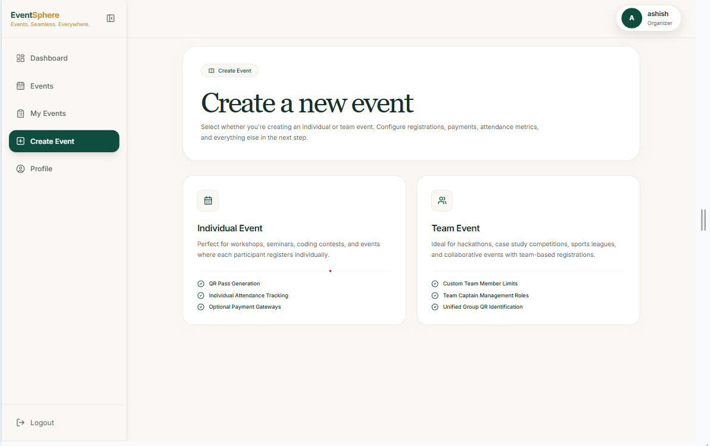
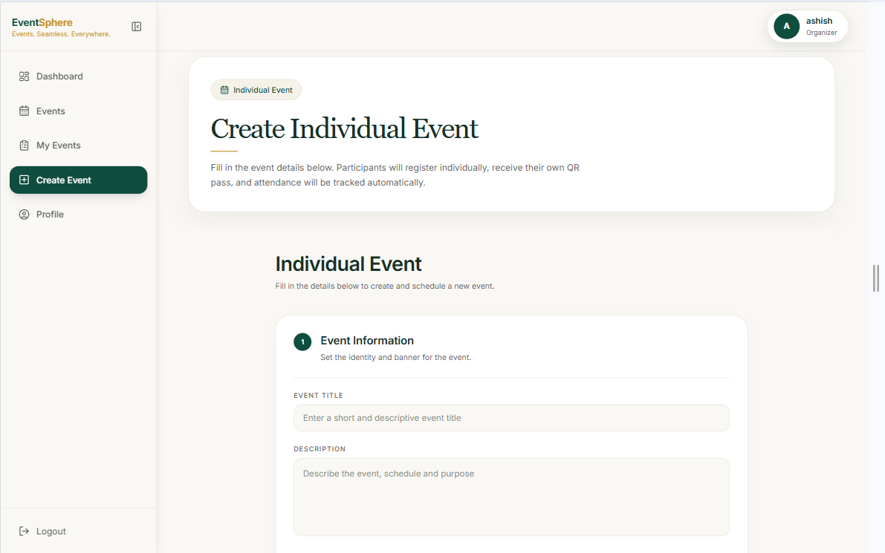
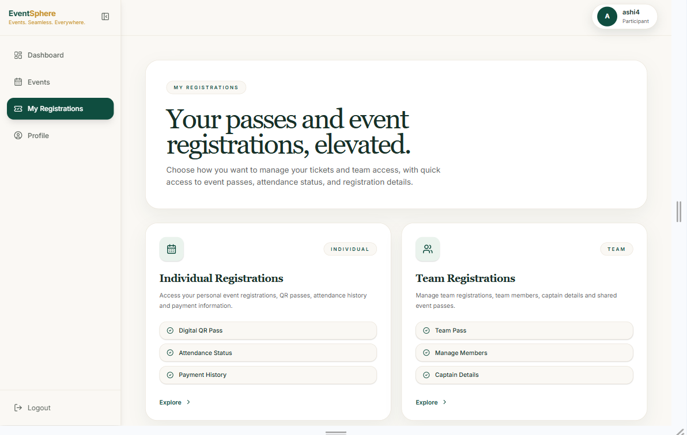

Markdown
# EventSphere - Smart Event Management Platform 🌐

A full-stack Event Management Platform built with FastAPI, Next.js (App Router), TypeScript, and SQLite. The platform enables users to discover events, register online, receive digital event passes, and allows administrators to manage events, participants, and attendance efficiently.

---

## 🚀 Key Features

### 👤 User & Role-Based Workflows
* **User Hub:** Personalized dashboard featuring dynamic tracking cards, support for both individual and team registration review, and immediate event discoverability feeds.
* **Organizer Panel:** Isolated control workflows to manage distinct event metrics, view analytical breakdowns, and track registered participants.
* **Admin Dashboard:** Centralized platform layout with optimized, responsive tracking grids and granular user promotion/demotion utilities.

### 🎫 Event & Registration Engines
* **Multi-Tier Registrations:** Scalable configuration pipelines supporting both individual entry points and complex multi-member team registrations.
* **Digital Passes & Security:** Automatic generation of unique, secure QR-based event passes for instant registration verification.
* **Real-time Attendance Scanner:** An embedded camera/scanner component allowing event managers to instantly scan digital passes and log live attendance records.

---

## 📸 Screenshots

| Page | Preview |
| :--- | :--- |
| **Home Page** | 
| **Events Feed** |  |
| **Event Details** | 
| **Create Event** |  |
| **Event Form** |  |
| **My Registrations** |  |

## ⚙️ Quick Start

### 1. Clone Repository
```bash
git clone [https://github.com/WebTesseract77/smart-event-management-platform.git](https://github.com/WebTesseract77/smart-event-management-platform.git)
cd smart-event-management-platform
2. Backend Setup
Bash
cd backend
python -m venv .venv
.venv\Scripts\Activate.ps1  # For Windows
pip install -r requirements.txt
uvicorn app.main:app --reload
3. Frontend Setup
Bash
cd ../frontend
npm install
npm run dev

✍️ Author
Ashish Madhav Choudhary | @WebTesseract77

This project is intended for educational purposes.