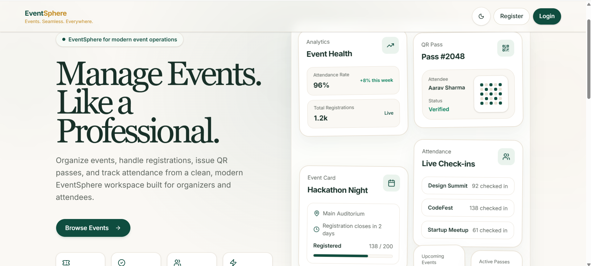
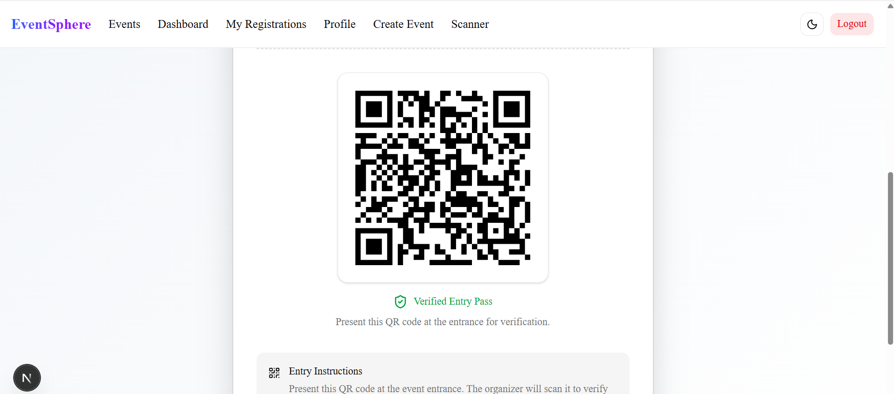
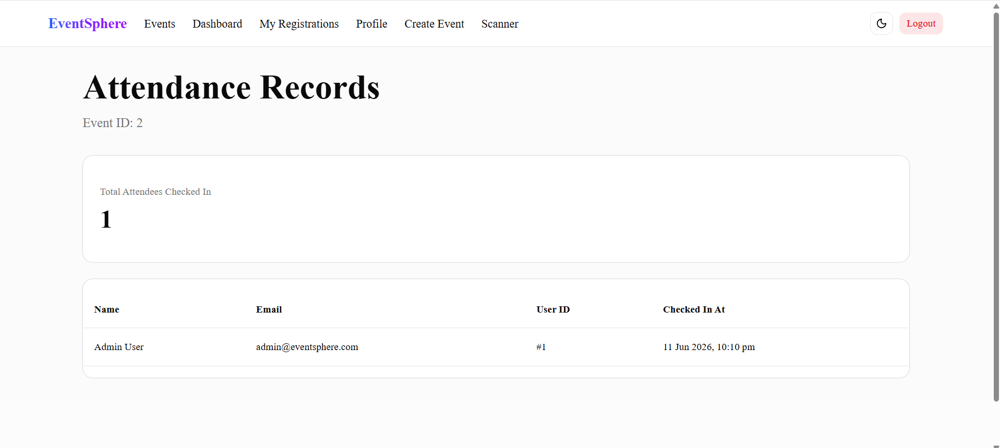

# EventSphere - Smart Event Management Platform

A full-stack Event Management Platform built with FastAPI, Next.js, TypeScript, and PostgreSQL/SQLite. The platform enables users to discover events, register online, receive digital event passes, and allows administrators to manage events, participants, and attendance efficiently.

## Features

### User Features

* User Registration and Login
* JWT Authentication
* Email Verification
* Forgot Password Functionality
* Browse Available Events
* Event Registration
* Digital Event Pass Generation
* View Registered Events
* Email Notifications

### Admin Features

* Create Events
* Edit Events
* Delete Events
* Manage Event Details
* View Event Participants
* Mark Attendance
* Attendance Dashboard

## Tech Stack

### Frontend

* Next.js
* TypeScript
* Tailwind CSS
* ShadCN UI

### Backend

* FastAPI
* SQLAlchemy
* Pydantic
* JWT Authentication

### Database

* PostgreSQL / SQLite

### Additional Services

* Email Notifications
* QR Code/Event Pass Generation

---

## Project Architecture

```text
smart-event-management-platform/
│
├── backend/
│   ├── app/
│   │   ├── core/
│   │   ├── models/
│   │   ├── routes/
│   │   ├── schemas/
│   │   ├── services/
│   │   └── database/
│   └── requirements.txt
│
├── frontend/
│   ├── app/
│   ├── components/
│   ├── lib/
│   └── package.json
│
└── README.md
```

## Key Functionalities

### Authentication System

* Secure JWT-based Authentication
* Role-Based Access Control (Admin/User)
* Protected Routes
* User Profile Management

### Event Management

* Create and Manage Events
* Event Scheduling
* Event Images
* Event Details Page

### Registration System

* One-click Registration
* Registration Validation
* Participant Management
* Registration History

### Attendance Tracking

* View Registered Participants
* Mark Attendance
* Attendance Monitoring

### Email Notifications

* Registration Confirmation Emails
* Email Verification
* Password Reset Support

### Digital Event Pass

* Automatic Pass Generation
* Unique Registration IDs
* Event Information Display

---

## Installation

### Clone Repository

```bash
git clone https://github.com/WebTesseract77/smart-event-management-platform.git
cd smart-event-management-platform
```

---

## Backend Setup

### Create Virtual Environment

```bash
python -m venv .venv
```

### Activate Virtual Environment

Windows:

```bash
.venv\Scripts\activate
```

### Install Dependencies

```bash
pip install -r backend/requirements.txt
```

### Configure Environment Variables

Create:

```text
backend/.env
```

Example:

```env
DATABASE_URL=sqlite:///./smart_event.db

SECRET_KEY=your-secret-key

ADMIN_EMAIL=admin@example.com
ADMIN_PASSWORD=your-password

MAIL_USERNAME=your-email@gmail.com
MAIL_PASSWORD=your-app-password
MAIL_FROM=your-email@gmail.com
MAIL_SERVER=smtp.gmail.com
MAIL_PORT=587
```

### Run Backend

```bash
uvicorn backend.app.main:app --reload
```

Backend runs at:

```text
http://127.0.0.1:8000
```

API Documentation:

```text
http://127.0.0.1:8000/docs
```

---

## Frontend Setup

```bash
cd frontend
npm install
npm run dev
```

Frontend runs at:

```text
http://localhost:3000
```

---

## Screenshots

### Home Page


The landing page provides a centralized platform for creating, managing, and attending events with features such as digital passes, attendance tracking, and participant management. 

### Events Page


Users can browse available events, view event information, and register instantly. Administrators can create, edit, delete, and manage events.

### Event Details


Detailed event information including venue, schedule, description, participant management, and registration controls.

### Digital Event Pass


Each registration generates a unique QR-based digital pass that can be 
verified during event entry and attendance tracking. 

### Attendance Dashboard


Administrators can scan attendee QR codes to instantly 
verify registrations and mark attendance in real time.
---

## API Endpoints

### Authentication

* POST `/api/v1/auth/register`
* POST `/api/v1/auth/login`

### Events

* GET `/api/v1/events`
* GET `/api/v1/events/{id}`
* POST `/api/v1/events`
* PATCH `/api/v1/events/{id}`
* DELETE `/api/v1/events/{id}`

### Registrations

* POST `/api/v1/events/{event_id}/register`
* DELETE `/api/v1/events/{event_id}/register`
* GET `/api/v1/me/registrations`

### Attendance

* POST `/api/v1/events/{event_id}/attendance/{user_id}`
* GET `/api/v1/events/{event_id}/attendance`

---

## Future Enhancements


* Event Analytics Dashboard
* Event Categories
* Search & Filtering
* Payment Gateway Integration
* Certificate Generation
* Real-time Notifications


---

## Author

**Ashish madhav Choudhary**

GitHub: https://github.com/WebTesseract77

---

## License

This project is intended for educational  purposes.
